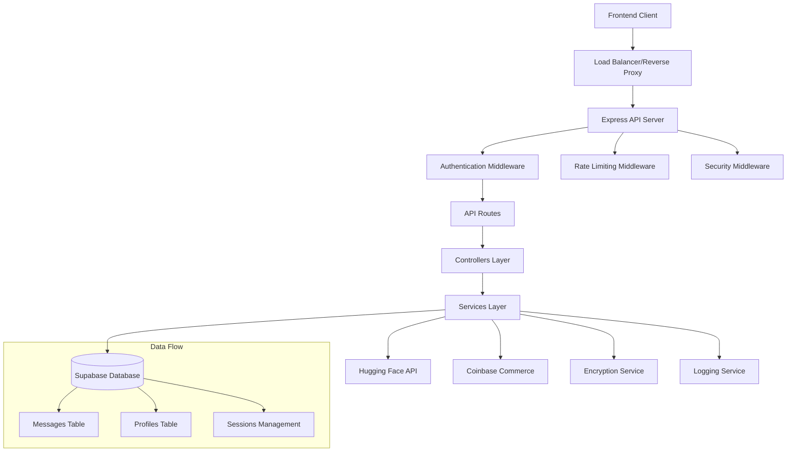

# Design Document

## Overview

This document outlines the design for overhauling the Keisha AI backend system. The redesign transforms a monolithic Express server into a modular, secure, and scalable architecture that integrates with Hugging Face's fine-tuned "DJanga24/keisha-qwen3-lora" model while maintaining existing Supabase and Coinbase Commerce integrations. The system emphasizes user privacy through encryption, robust conversation history management, and comprehensive security measures.

## Architecture

### High-Level Architecture



### Directory Structure

```
keisha-backend/
├── .env                     # Environment variables
├── .gitignore              # Git ignore file
├── package.json            # Project dependencies
├── server.js               # Main server entry point
└── src/
    ├── config/
    │   └── index.js        # Configuration loader
    ├── controllers/
    │   ├── chatController.js    # Chat request handling
    │   └── paymentController.js # Payment processing
    ├── middleware/
    │   ├── auth.js         # JWT authentication
    │   ├── errorHandler.js # Centralized error handling
    │   └── security.js     # Security middleware setup
    ├── routes/
    │   ├── chatRoutes.js   # Chat API routes
    │   └── paymentRoutes.js # Payment API routes
    ├── services/
    │   ├── huggingfaceService.js # HF API integration
    │   ├── conversationService.js # Chat history management
    │   ├── encryptionService.js  # Message encryption
    │   └── supabaseService.js    # Database operations
    └── utils/
        ├── logger.js       # Winston logging setup
        └── validators.js   # Input validation utilities
```

## Components and Interfaces

### 1. Configuration Management (`src/config/index.js`)

**Purpose:** Centralized configuration loading and validation

**Interface:**
```javascript
module.exports = {
  port: number,
  nodeEnv: string,
  huggingfaceApiKey: string,
  encryptionKey: string,
  allowedOrigins: string[],
  supabase: {
    url: string,
    serviceRoleKey: string
  },
  coinbase: {
    apiKey: string,
    webhookSecret: string
  },
  logging: {
    level: string
  }
}
```

### 2. Hugging Face Service (`src/services/huggingfaceService.js`)

**Purpose:** Handle communication with Hugging Face API for the Keisha model

**Key Methods:**
- `generateChatResponse(systemPrompt, userMessage, context)`: Generate AI responses
- `validateModel()`: Verify model availability
- `handleRateLimit()`: Manage API rate limiting

**Interface:**
```javascript
class HuggingFaceService {
  async generateChatResponse(systemPrompt, userMessage, context = [])
  async validateModelAvailability()
  handleApiError(error)
}
```

### 3. Encryption Service (`src/services/encryptionService.js`)

**Purpose:** Provide end-to-end encryption for user messages and conversations

**Key Methods:**
- `encryptMessage(plaintext)`: Encrypt user messages before storage
- `decryptMessage(ciphertext)`: Decrypt messages for retrieval
- `encryptResponse(response)`: Optional response encryption
- `generateSessionKey()`: Create session-specific encryption keys

**Interface:**
```javascript
class EncryptionService {
  encryptMessage(plaintext: string): string
  decryptMessage(ciphertext: string): string
  encryptResponse(response: string): string
  generateSessionKey(): string
  validateEncryptionKey(): boolean
}
```

### 4. Conversation Service (`src/services/conversationService.js`)

**Purpose:** Manage conversation history, threading, and context preservation

**Key Methods:**
- `saveMessage(userId, sessionId, userMessage, aiResponse)`: Store conversation
- `getConversationHistory(sessionId, limit)`: Retrieve chat history
- `createNewSession(userId)`: Initialize new conversation thread
- `getSessionContext(sessionId)`: Get recent context for AI

**Interface:**
```javascript
class ConversationService {
  async saveMessage(userId, sessionId, userMessage, aiResponse, encrypted = false)
  async getConversationHistory(sessionId, limit = 50, offset = 0)
  async createNewSession(userId): Promise<string>
  async getSessionContext(sessionId, contextLimit = 10)
  async deleteSession(sessionId, userId)
}
```

### 5. Authentication Middleware (`src/middleware/auth.js`)

**Purpose:** Validate JWT tokens and manage user authentication

**Key Features:**
- Supabase JWT validation
- User context injection
- Route protection
- Token refresh handling

### 6. Chat Controller (`src/controllers/chatController.js`)

**Purpose:** Handle chat API requests with proper validation and response formatting

**Key Methods:**
- `handleChatRequest()`: Process incoming chat messages
- `getConversationHistory()`: Retrieve user's chat history
- `createNewConversation()`: Start new conversation thread

## Data Models

### Message Model (Supabase)
```sql
CREATE TABLE messages (
  id UUID PRIMARY KEY DEFAULT gen_random_uuid(),
  user_id UUID REFERENCES auth.users(id),
  session_id UUID NOT NULL,
  user_prompt TEXT NOT NULL,
  ai_response TEXT NOT NULL,
  model_used VARCHAR(100) DEFAULT 'DJanga24/keisha-qwen3-lora',
  encrypted BOOLEAN DEFAULT false,
  created_at TIMESTAMP WITH TIME ZONE DEFAULT NOW(),
  updated_at TIMESTAMP WITH TIME ZONE DEFAULT NOW()
);
```

### Session Model (Supabase)
```sql
CREATE TABLE conversation_sessions (
  id UUID PRIMARY KEY DEFAULT gen_random_uuid(),
  user_id UUID REFERENCES auth.users(id),
  title VARCHAR(255),
  created_at TIMESTAMP WITH TIME ZONE DEFAULT NOW(),
  updated_at TIMESTAMP WITH TIME ZONE DEFAULT NOW(),
  message_count INTEGER DEFAULT 0
);
```

### Profiles Model (Existing - Enhanced)
```sql
-- Existing table with additional fields
ALTER TABLE profiles ADD COLUMN IF NOT EXISTS 
  encryption_enabled BOOLEAN DEFAULT true,
  conversation_retention_days INTEGER DEFAULT 90;
```

## Error Handling

### Error Categories
1. **Authentication Errors (401/403)**
   - Invalid JWT tokens
   - Expired sessions
   - Insufficient permissions

2. **Validation Errors (400)**
   - Missing required fields
   - Invalid input formats
   - Encryption/decryption failures

3. **Service Errors (500/502/503)**
   - Hugging Face API failures
   - Database connection issues
   - Encryption service failures

4. **Rate Limiting (429)**
   - API rate limits exceeded
   - User request limits reached

### Error Response Format
```javascript
{
  error: {
    code: "ERROR_CODE",
    message: "Human readable message",
    details: "Technical details for debugging",
    timestamp: "2025-01-19T10:30:00Z"
  }
}
```

## Security Design

### 1. Request Security
- **Helmet.js**: Security headers (CSP, HSTS, etc.)
- **CORS**: Configurable origin restrictions
- **Rate Limiting**: Per-IP and per-user limits
- **Input Validation**: Comprehensive request validation

### 2. Data Security
- **Encryption at Rest**: AES-256 encryption for messages
- **Encryption in Transit**: HTTPS enforcement
- **Key Management**: Environment-based key storage
- **Session Security**: Secure session handling

### 3. API Security
- **JWT Validation**: Supabase Auth integration
- **Request Signing**: Optional request signing for sensitive operations
- **Audit Logging**: Comprehensive security event logging

## Testing Strategy

### 1. Unit Tests
- Service layer testing (encryption, conversation management)
- Utility function testing (validators, formatters)
- Middleware testing (auth, error handling)

### 2. Integration Tests
- Hugging Face API integration
- Supabase database operations
- End-to-end chat flow testing

### 3. Security Tests
- Encryption/decryption validation
- Authentication bypass attempts
- Rate limiting verification
- Input validation testing

### 4. Performance Tests
- API response time benchmarks
- Database query optimization
- Memory usage monitoring
- Concurrent user handling

## Migration Strategy

### Phase 1: Infrastructure Setup
1. Install new dependencies
2. Create directory structure
3. Set up configuration management
4. Implement logging system

### Phase 2: Core Services
1. Implement encryption service
2. Create Hugging Face service
3. Build conversation service
4. Set up authentication middleware

### Phase 3: API Migration
1. Migrate chat endpoints
2. Update payment processing
3. Implement new error handling
4. Add security middleware

### Phase 4: Testing & Deployment
1. Comprehensive testing
2. Performance optimization
3. Security audit
4. Production deployment

## Environment Variables

```bash
# Server Configuration
PORT=3001
NODE_ENV=production

# Hugging Face Configuration
HUGGINGFACE_API_KEY=your_huggingface_api_key
HUGGINGFACE_MODEL=DJanga24/keisha-qwen3-lora

# Encryption Configuration
ENCRYPTION_KEY=your_32_character_encryption_key
SESSION_ENCRYPTION_ENABLED=true

# Database Configuration (Existing)
SUPABASE_URL=your_supabase_url
SUPABASE_SERVICE_ROLE_KEY=your_service_role_key

# Payment Configuration (Existing)
COINBASE_COMMERCE_API_KEY=your_coinbase_api_key
COINBASE_WEBHOOK_SECRET=your_webhook_secret

# Security Configuration
ALLOWED_ORIGINS=https://keisha.ai,http://localhost:3000
JWT_SECRET=your_jwt_secret

# Logging Configuration
LOG_LEVEL=info
LOG_FILE_PATH=./logs/keisha-backend.log
```

## Performance Considerations

### 1. Caching Strategy
- **Session Context Caching**: Redis for frequently accessed conversation context
- **Model Response Caching**: Cache similar queries to reduce API calls
- **Configuration Caching**: In-memory config caching

### 2. Database Optimization
- **Connection Pooling**: Supabase connection optimization
- **Query Optimization**: Indexed queries for conversation retrieval
- **Batch Operations**: Bulk message storage for high-volume scenarios

### 3. API Optimization
- **Request Batching**: Combine multiple operations where possible
- **Compression**: Response compression for large conversation histories
- **Streaming**: Consider streaming responses for long AI generations

This design provides a robust, secure, and scalable foundation for the Keisha AI backend while maintaining compatibility with existing systems and adding the requested privacy and conversation management features.